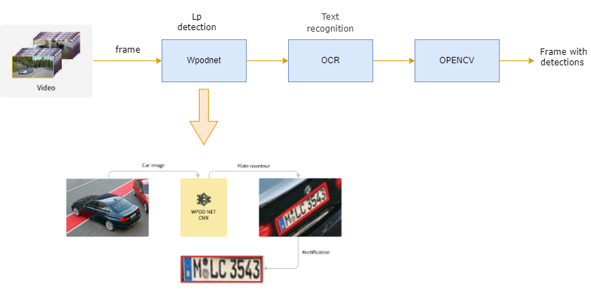

# License plate detection and recognition #
## About ##
 Korean  license plate detection and recognition (ALPR) pipeline.Repisotory based PyTorch and Tensorflow frameworks.
 LP detection part used Wpodnet (Tensorflow) technique and Character Recognition (OCR) part is based Pytorch. Both technique is combined by python    
## Method ##


## Dependencies ##
```
$ conda create -n alpr python=3.7  # create environment
$ git clone https://github.com/AbbosAbdullayev/ALPR  # clone
$ cd ALPR 
$ pip install -r requirements.txt  # installing dependencies
```
## Usage ##
```
$ python main.py --video ('input video file name') --output ('output file name and expected format e.x:output.mp4')
```
## Testing ##
## Video Inference ##
## Reference ##
1.https://github.com/KavenLee/wpod_ocr
2.https://github.com/sergiomsilva/alpr-unconstrained
